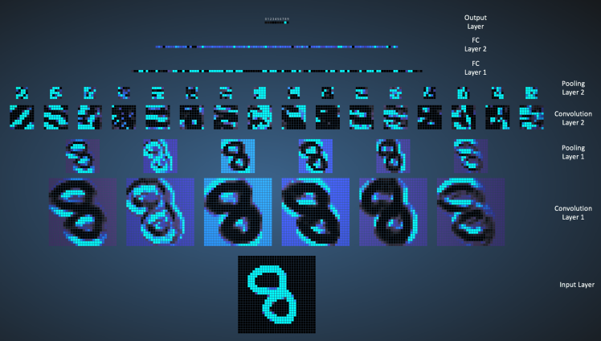

# Image Classification Workshop Part II

**organised by [Vancouver School of AI](https://www.facebook.com/groups/991378534367193/)**

**Date: 11 September 2018**

Source: http://scs.ryerson.ca/~aharley/vis/conv/

## Installation Requirements

We have decided to move to [Google Colab](https://colab.research.google.com/notebooks/welcome.ipynb#recent=true). This means you only need a Google account and you're good to go. Google Colab is especially useful for image classification, since you can use a GPU for free on Google Colab to speed up the training process. See [here](https://www.kdnuggets.com/2018/02/google-colab-free-gpu-tutorial-tensorflow-keras-pytorch.html) on how to enable a GPU in Google Colab - it's really simple.

## Content Authors

[Akshi Chaudhary](https://github.com/akshi8)

[Johannes Harmse](https://github.com/johannesharmse)

[Xinbin Huang](https://github.com/xinbinhuang)

## Resources and Additional Readings

[Visualize Image Classification](http://scs.ryerson.ca/~aharley/vis/conv/)

[How CNNs work](http://cs231n.github.io/convolutional-networks/)

[Keras CNN Data Augmentation](https://blog.keras.io/building-powerful-image-classification-models-using-very-little-data.html)

